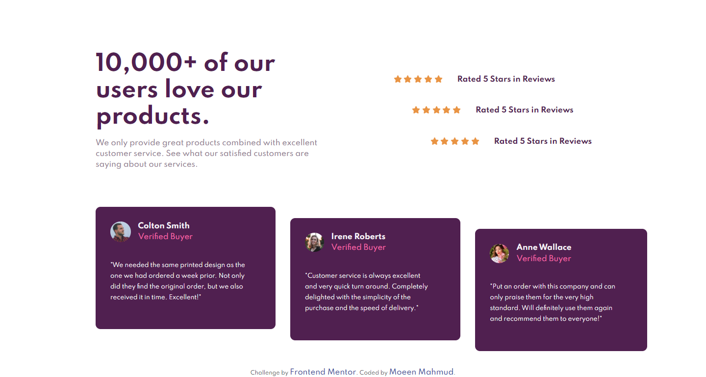

# Frontend Mentor - Social proof section solution

This is a solution to the [Social proof section challenge on Frontend Mentor](https://www.frontendmentor.io/challenges/social-proof-section-6e0qTv_bA). Frontend Mentor challenges help you improve your coding skills by building realistic projects.

## Table of contents

- [Overview](#overview)
  - [The challenge](#the-challenge)
  - [Screenshot](#screenshot)
  - [Links](#links)
- [My process](#my-process)
  - [Built with](#built-with)
  - [What I learned](#what-i-learned)
  - [Continued development](#continued-development)
  - [Useful resources](#useful-resources)
- [Author](#author)

## Overview

### The challenge

Users should be able to view the optimal layout depending on their device's screen size

### Screenshot



### Links

- Solution URL: [Git Repo](https://github.com/moeen-mahmud/social-proof-section)
- Live Site URL: [Live Site](https://social-proof-section-moeen-mahmud.vercel.app/)

## My Process

### Built With

- HTML5 markup
- CSS custom properties
- Flexbox
- Grid
- Mobile-first workflow
- [GoogleFonts](https://fonts.google.com/) - For font styles

### What I learned

This challenge seems to be easy but the layout positioning is little tricky. I struggled a bit to organize the cards. I tried my best to follow the design jpeg file and guess the position. Though it is not pixel perfect but relatively same to the original. I place the css code below, where I experimented the position. I don't know whether this method is the best practice or not.

```css
.card {
  padding: 2rem 4rem 2rem 2rem;
  background-color: var(--primary-very-dark-magenta);
  border-radius: 10px;
  height: 250px;
}
```

I used both grid and flexbox though and added various breakpoints other than 375px and 1440px.

### Continued Development

I really enjoy the challenges from [Frontend Mentor](https://www.frontendmentor.io) and surely these challenges are helping me to improve my skills.

### Useful resources

- [Conquering Responsive Layouts](https://courses.kevinpowell.co/) - [Kevin](https://twitter.com/KevinJPowell) is one of my favourite instructor and I learned a lot of CSS **Techniques** from him.
- [MDN](https://developer.mozilla.org/en-US/) - There is nothing new to say about this resource.

## Author

- Frontend Mentor - [fahim-mahmud](https://www.frontendmentor.io/profile/fahim-mahmud)
- Twitter - [moeen_mahmud](https://twitter.com/moeen_mahmud)
